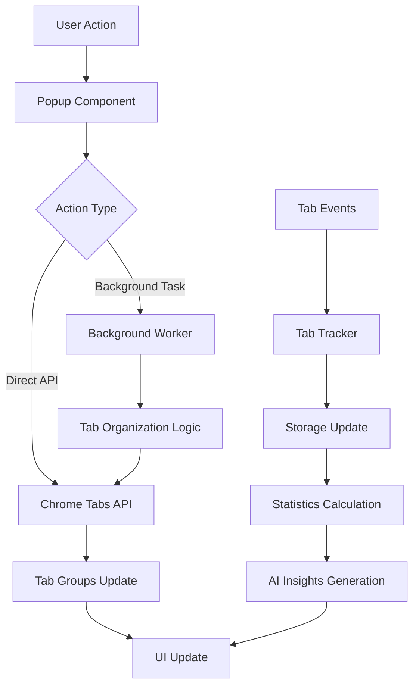

# 아키텍처 개요

## 시스템 구조

TabQuest는 Chrome Extension Manifest V3 기반으로 구축되었으며, WXT 프레임워크를 사용하여 개발 경험을 향상시켰습니다.

## 핵심 컴포넌트

### 1. Entry Points (진입점)

#### Background Service Worker (`background.ts`)
- **역할**: 확장 프로그램의 백그라운드 로직 처리
- **주요 기능**:
  - 탭 사용량 추적 초기화
  - 메시지 핸들링 (popup ↔ background 통신)
  - 탭 정리 로직 실행
  - 주기적인 데이터 정리

```typescript
// 메시지 핸들러 구조
chrome.runtime.onMessage.addListener((request, sender, sendResponse) => {
  switch(request.action) {
    case 'smartOrganize': // 스마트 정리
    case 'getTabsAnalysis': // 탭 분석
    case 'organizeByCategories': // 카테고리별 정리
  }
});
```

#### Popup Component (`popup-component.tsx`)
- **역할**: 사용자 인터페이스의 메인 컴포넌트
- **주요 기능**:
  - 현재 탭 상태 표시
  - AI 인사이트 카드 렌더링
  - 생산성 점수 표시
  - 탭 정리 트리거

#### Options Page (`options.tsx`)
- **역할**: 확장 프로그램 설정 페이지
- **주요 기능**:
  - 카테고리 관리
  - 언어 설정
  - 데이터 초기화

### 2. 상태 관리 (State Management)

#### Store 구조
```typescript
// categoryStore.ts
interface CategoryStore {
  categories: Category[]
  categoryMapping: Record<string, string>
  loadCategories: () => Promise<void>
  addCategory: (category: Category) => Promise<void>
  updateCategory: (id: string, updates: Partial<Category>) => Promise<void>
  deleteCategory: (id: string) => Promise<void>
  setCategoryMapping: (domain: string, categoryId: string) => Promise<void>
  getCategoryForDomain: (domain: string) => string
}

// tabStore.ts
interface TabStore {
  tabs: TabInfo[]
  setTabs: (tabs: TabInfo[]) => void
  getTabsByCategory: (categoryId: string) => TabInfo[]
}

// aiStore.ts
interface AIStore {
  insights: AIInsight[]
  productivityScore: number
  addInsight: (insight: AIInsight) => void
  removeInsight: (id: string) => void
  setProductivityScore: (score: number) => void
}
```

### 3. 데이터 흐름



## 핵심 알고리즘

### 탭 정리 알고리즘

1. **도메인 추출**: URL에서 호스트네임 추출 및 정규화
2. **카테고리 매칭**:
   - 사용자 정의 매핑 우선
   - 카테고리 도메인 리스트 확인
   - 미분류 시 'uncategorized'로 분류
3. **그룹 생성**:
   - 모든 탭 언그룹
   - 카테고리 순서대로 탭 재정렬
   - Chrome Tab Groups API로 그룹 생성

### 사용량 추적 알고리즘

```typescript
// 추적 플로우
1. Tab Activation → Start Timer
2. Tab Change/Deactivation → Stop Timer & Calculate Duration
3. Update Storage:
   - Tab Usage Data (도메인별 누적 시간)
   - Daily Statistics (일별 통계)
   - Category Breakdown (카테고리별 시간)
```

## 저장소 구조

### Chrome Storage Sync
- `categories`: 사용자 정의 카테고리 목록
- `categoryMapping`: 도메인 → 카테고리 매핑
- `language`: 선택된 언어
- `hasSeenWelcome`: 첫 사용자 체크

### Chrome Storage Local
- `tabUsageData`: 탭 사용량 상세 데이터
- `dailyStats`: 일별 통계 데이터
- `aiInsights`: AI 생성 인사이트

## 성능 최적화

### 1. Direct Chrome API 사용
- Background script 우회로 즉각적인 응답
- `organizeTabsDirectly()` 함수로 직접 탭 조작

### 2. Debouncing & Throttling
- 탭 변경 이벤트 처리 최적화
- 6초마다 사용량 업데이트 (Chrome Alarms API)

### 3. 효율적인 상태 관리
- Zustand의 선택적 구독으로 불필요한 리렌더링 방지
- 메모이제이션을 통한 연산 최적화

## 보안 고려사항

1. **Manifest V3 준수**
   - Service Worker 사용
   - Content Security Policy 적용

2. **권한 최소화**
   - 필요한 권한만 요청
   - Host permissions 없음

3. **데이터 보호**
   - 민감한 정보 저장 안 함
   - 로컬 스토리지 암호화 없음 (브라우저 보안에 의존)