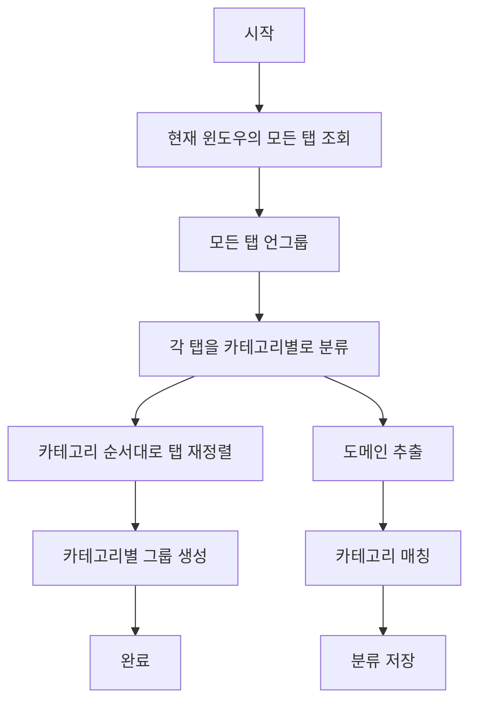

# 탭 정리 시스템 상세 문서

## 개요

TabQuest의 탭 정리 시스템은 사용자의 브라우저 탭을 자동으로 분류하고 그룹화하여 효율적인 탭 관리를 돕습니다.

## 핵심 컴포넌트

### 1. Unified Organizer (`unifiedOrganizer.ts`)

통합 정리 로직의 중심으로, 모든 탭 정리 작업을 처리합니다.

```typescript
export async function organizeTabsUnified(categories: Category[])
```

#### 동작 프로세스



#### 상세 구현

##### Step 1: 탭 언그룹
```typescript
const allTabIds = tabs.map(tab => tab.id).filter(id => id !== undefined);
await chrome.tabs.ungroup(allTabIds);
```

##### Step 2: 카테고리 분류
```typescript
const categorizedTabs = new Map<string, chrome.tabs.Tab[]>();

for (const tab of tabs) {
  // 시스템 URL 제외
  if (tab.url.startsWith('chrome://') || tab.url.startsWith('edge://')) {
    continue;
  }

  const domain = new URL(tab.url).hostname.replace(/^www\./, '');
  const categoryId = getCategoryForDomain(domain);

  if (!categorizedTabs.has(categoryId)) {
    categorizedTabs.set(categoryId, []);
  }
  categorizedTabs.get(categoryId)!.push(tab);
}
```

##### Step 3: 탭 재정렬
```typescript
let currentPosition = 0;
const reorderedTabIds: number[] = [];

for (const category of categories) {
  const categoryTabs = categorizedTabs.get(category.id);
  if (!categoryTabs) continue;

  for (const tab of categoryTabs) {
    if (tab.id) {
      reorderedTabIds.push(tab.id);
    }
  }
}

// 물리적으로 탭 위치 이동
for (let i = 0; i < reorderedTabIds.length; i++) {
  await chrome.tabs.move(reorderedTabIds[i], { index: i });
}
```

##### Step 4: 그룹 생성
```typescript
for (const category of categories) {
  const categoryTabs = categorizedTabs.get(category.id);
  if (!categoryTabs || categoryTabs.length === 0) continue;

  const tabIds = categoryTabs.map(t => t.id).filter(id => id !== undefined);

  // 그룹 생성
  const groupId = await chrome.tabs.group({ tabIds });

  // 그룹 속성 설정
  const abbreviation = category.name
    .split(' ')
    .map(word => word.charAt(0).toUpperCase())
    .join('')
    .slice(0, 3);

  await chrome.tabGroups.update(groupId, {
    title: abbreviation,
    color: category.color,
    collapsed: false
  });
}
```

### 2. Direct Organizer (`directOrganizer.ts`)

Background script를 거치지 않고 직접 Chrome API를 호출하는 방식입니다.

#### 특징
- **빠른 응답**: Background script 통신 오버헤드 없음
- **동기적 처리**: 순차적인 API 호출로 안정성 보장
- **에러 처리**: 각 단계별 try-catch로 부분 실패 처리

### 3. Domain-based Organization

도메인 기반 간단한 정리 기능입니다.

```typescript
export async function organizeTabsByDomain() {
  const domainGroups = new Map<string, number[]>();

  // 도메인별로 탭 그룹화
  for (const tab of tabs) {
    const domain = new URL(tab.url).hostname;
    domainGroups.get(domain).push(tab.id);
  }

  // 2개 이상 탭이 있는 도메인만 그룹 생성
  for (const [domain, tabIds] of domainGroups) {
    if (tabIds.length >= 2) {
      const groupId = await chrome.tabs.group({ tabIds });
      await chrome.tabGroups.update(groupId, {
        title: domain.slice(0, 3).toUpperCase(),
        color: colors[colorIndex]
      });
    }
  }
}
```

## 카테고리 매칭 알고리즘

### 우선순위 시스템

1. **사용자 정의 매핑** (최우선)
   - 사용자가 직접 지정한 도메인-카테고리 매핑
   - `categoryMapping[domain]` 확인

2. **카테고리 도메인 리스트**
   - 각 카테고리에 사전 정의된 도메인 목록
   - 정확한 매칭 및 서브도메인 매칭

3. **패턴 매칭**
   - 서브도메인 처리: `mail.google.com` → `google.com`
   - 와일드카드 지원: `*.github.io`

4. **미분류 (fallback)**
   - 매칭되지 않은 모든 탭은 'uncategorized'

### 구현 예시

```typescript
function getCategoryForDomain(domain: string): string {
  // 1. 사용자 매핑
  if (categoryMapping[domain]) {
    return categoryMapping[domain];
  }

  // 2. 카테고리 도메인
  for (const category of categories) {
    // 정확한 매칭
    if (category.domains.includes(domain)) {
      return category.id;
    }

    // 서브도메인 매칭
    const found = category.domains.some(d => {
      return domain === d || domain.endsWith(`.${d}`);
    });

    if (found) {
      return category.id;
    }
  }

  // 3. 미분류
  return 'uncategorized';
}
```

## 그룹 색상 시스템

Chrome Tab Groups API에서 지원하는 색상:

```typescript
type ColorEnum = 'grey' | 'blue' | 'red' | 'yellow' |
                 'green' | 'pink' | 'purple' | 'cyan' | 'orange';
```

### 색상 할당 전략

1. **카테고리 기본 색상**: 각 카테고리에 사전 정의된 색상
2. **순환 할당**: 색상이 지정되지 않은 경우 순환하여 할당
3. **충돌 방지**: 이미 사용 중인 색상 피하기

## 성능 최적화

### 1. 배치 처리
```typescript
// 나쁜 예: 개별 처리
for (const tabId of tabIds) {
  await chrome.tabs.move(tabId, { index });
}

// 좋은 예: 배치 처리
await chrome.tabs.move(tabIds, { index });
```

### 2. 병렬 처리
```typescript
// 독립적인 작업은 Promise.all로 병렬 처리
await Promise.all([
  chrome.tabs.ungroup(tabIds1),
  chrome.tabs.ungroup(tabIds2)
]);
```

### 3. 에러 격리
```typescript
for (const category of categories) {
  try {
    // 각 카테고리별로 독립적 처리
    await createGroup(category);
  } catch (error) {
    // 한 카테고리 실패가 전체를 중단시키지 않음
    continue;
  }
}
```

## 특수 케이스 처리

### 1. 새 탭 처리
```typescript
const NEW_TAB_URLS = [
  'chrome://newtab/',
  'edge://newtab/',
  'about:blank',
  'about:newtab'
];

if (NEW_TAB_URLS.includes(tab.url)) {
  normalizedUrl = '__newtab__';
}
```

### 2. 시스템 URL 제외
```typescript
const SYSTEM_URL_PREFIXES = ['chrome://', 'edge://', 'about:'];

if (SYSTEM_URL_PREFIXES.some(prefix => tab.url.startsWith(prefix))) {
  continue; // 그룹화하지 않음
}
```

### 3. Extension URL 처리
```typescript
// Extension URL은 그룹화 가능
if (tab.url.startsWith('chrome-extension://')) {
  // 정상 처리
}
```

## 문제 해결

### 일반적인 문제

#### 1. 탭이 그룹화되지 않음
- **원인**: 시스템 URL, 권한 부족
- **해결**: URL 타입 확인, 권한 검증

#### 2. 그룹 순서가 뒤바뀜
- **원인**: 비동기 처리로 인한 경쟁 상태
- **해결**: 순차적 처리 또는 명시적 순서 지정

#### 3. 중복 그룹 생성
- **원인**: 언그룹 실패
- **해결**: 언그룹 에러 무시하고 진행

### 디버깅 팁

```typescript
// 상태 확인
const groups = await chrome.tabGroups.query({});
console.log('Current groups:', groups);

// 탭 정보 확인
const tabs = await chrome.tabs.query({ currentWindow: true });
console.log('Tab count:', tabs.length);
console.log('Grouped tabs:', tabs.filter(t => t.groupId !== -1).length);
```